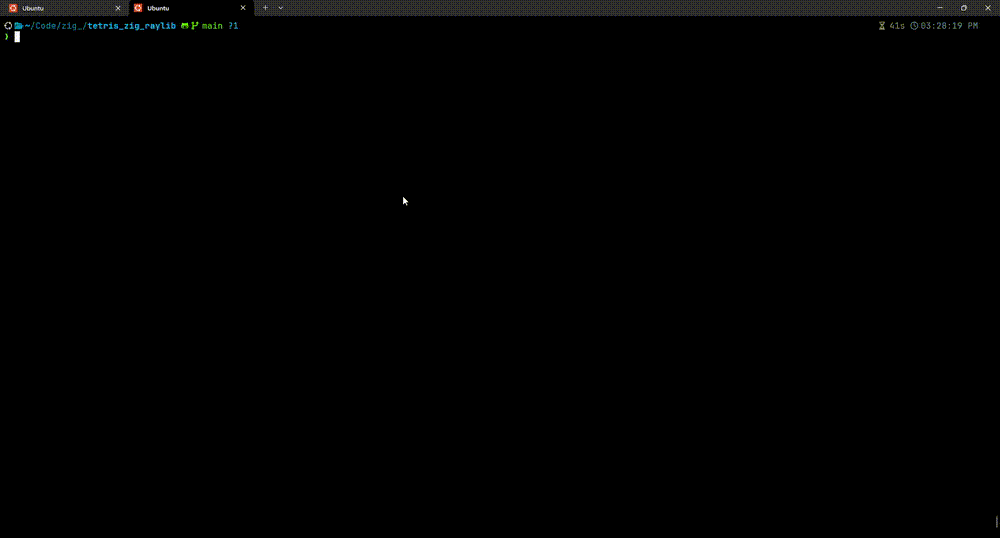

# Tetris in Zig with Raylib
h3bzzz

A fully-featured Tetris clone written in [Zig](https://ziglang.org/), rendered with [raylib](https://www.raylib.com/). This project was my first attempt at getting Zig to know the raylib library and see what Zig could really do with the new version 
releases of 0.17.0-dev.
---

## Features

The implementation covers the core mechanics expected of a competent Tetris variant:

- **Seven tetromino types**: O, L, J, I, T, S, and Z pieces, each with distinct colors and shadow tones.
- **Ghost piece**: A transparent preview of where the active piece will land, computed via collision scanning.
- **Hard and soft drop**: Down arrow accelerates descent; Spacebar performs an instant hard drop with bonus scoring proportional to distance.
- **Lock delay**: A 30-frame grace period after a piece lands, allowing the player to slide or rotate before the piece commits.
- **Line clearing with animation**: Completed lines flash briefly before collapsing the stack above.
- **Progressive difficulty**: Level increases every 10 lines, reducing gravity speed from 30 frames per cell down to a minimum of 5.
- **Scoring system**: 100 / 300 / 500 / 800 points per 1-4 lines, multiplied by current level. Hard drops award 2 points per cell dropped.
- **Game state management**: Title screen, active play, pause, and game over states with full reset capability.
- **Responsive layout**: The playfield and UI scale dynamically to fit the window dimensions while maintaining square cells.

---
<p align="center">
  
</p>


## Controls

| Key | Action |
|-----|--------|
| `Enter` | Start / Restart |
| `Left / Right` | Move piece |
| `Up` | Rotate clockwise |
| `Down` | Soft drop |
| `Space` | Hard drop |
| `P` | Pause |
| `Q` | Quit |

---

## Using Raylib with Zig

Raylib is a straightforward choice with the hype around it's simplicity. Raylib will give anyone trying to attempt bare-bone game-development coding a really solid foundation. I had a lot of fun just getting shapes to draw and move on the screen and introduce collision functions, this eventually led me to creating a tetris game. Something easy, that everyone has done just to get acquainted more with Zig and Raylib.

## Building and Running

### Prerequisites

- [Zig](https://ziglang.org/download/) (master / 0.17.0-dev or later, as specified in `build.zig.zon`)
- A C compiler toolchain (Zig bundles `clang` and can act as its own linker, but raylib compiles C source during the build)
- Platform dependencies for raylib:
  - **Linux**: `libgl1-mesa-dev`, `libx11-dev`, `libxcursor-dev`, `libxinerama-dev`, `libxrandr-dev`, `libxi-dev`
  - **macOS**: Xcode Command Line Tools
  - **Windows**: No external dependencies required

### Build

```bash
zig build
```

The executable is emitted to `zig-out/bin/tetris`.

### Run

```bash
zig build run
```

### Test

```bash
zig build test
```

---

## Project Structure

```
.
├── build.zig          # Build configuration: executable, dependencies, test runners
├── build.zig.zon      # Package manifest: declares raylib-zig dependency
├── src/
│   ├── main.zig       # Game loop, state management, rendering, and input
│   └── root.zig       # Module root (conventional Zig package entry point)
└── zig-pkg/           # Fetched dependency cache (raylib, raylib-zig bindings, Emscripten)
```

---

## License

This project is released under the MIT License. See `LICENSE` for details.
